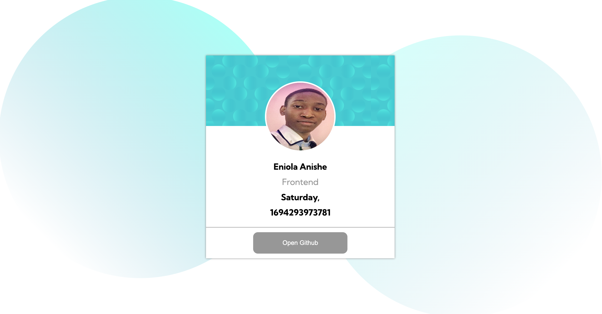

# Slack - Profile card component solution

This is a solution to the [Slack Profile card component coding task ].

## Table of contents

- [Overview](#overview)
  - [The challenge](#the-challenge)
  - [Screenshot](#screenshot)
  - [Links](#links)
  - [Built with](#built-with)

## Overview
A Slack Profile Page Componenet that showcases specific personal and real-time data attributes of your Slack Profile.

### Screenshot

### Links

- Live Site URL:(https://profile-page-component.netlify.app)

### Built with

- HTML5 markup
- CSS custom properties
- Flexbox
- JavaScript

